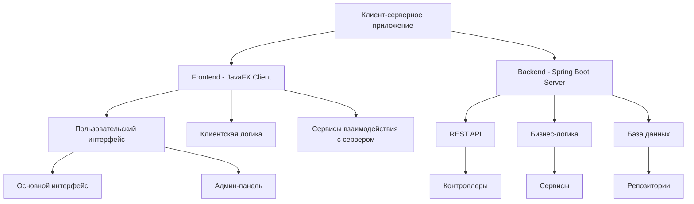
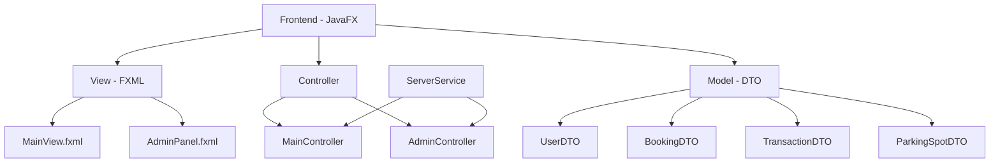
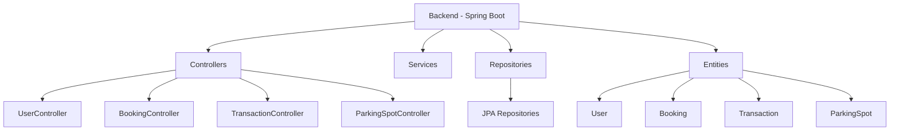
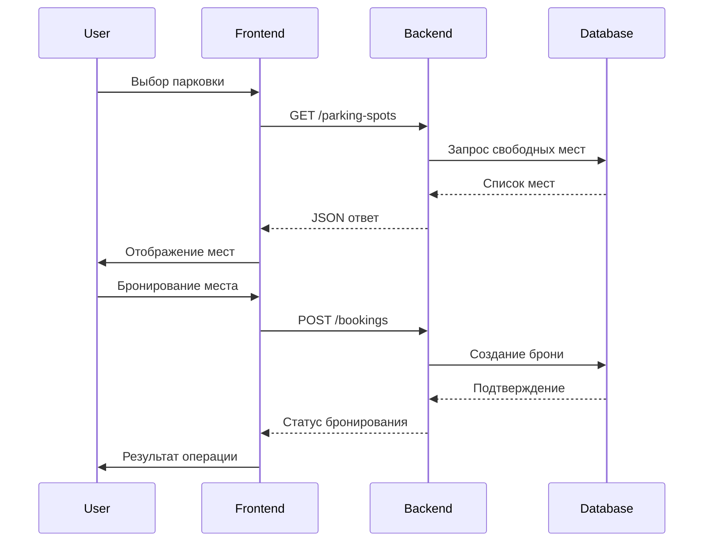
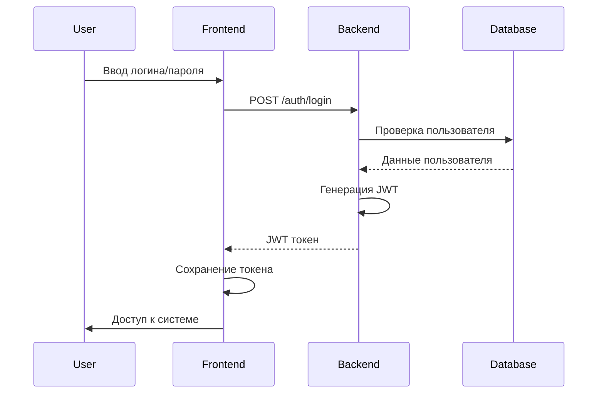

# 🅿️ Система бронирования парковочных мест

<div align="center">

[](https://www.oracle.com/java/)
[](https://spring.io/)
[](https://openjfx.io/)
[](https://www.mysql.com/)
[](https://maven.apache.org/)
[](https://jwt.io/)

&nbsp;
&nbsp;
&nbsp;
&nbsp;


📚 Курсовая работа по дисциплине «Современные технологии программирования»  
‍🎓 Выполнил студент 3-его курса группы ПИ22-1 Косарев Григорий

</div>

---

<div align="center">

### 🚀 Быстрый старт

[](#-установка)
[](#-о-проекте)
[](#-установка)

</div>

## 📝 Содержание

<div align="center">

[](#-о-проекте)
[](#-архитектура)
[](#-технологический-стек)
[](#-установка)

</div>

---

## 🎯 О проекте

<div align="center">

### 🌟 Современное решение для управления парковкой

</div>

Информационная система для бронирования парковочных мест в торговых центрах, реализованная как современное клиент-серверное приложение с удобным графическим интерфейсом.

### ✨ Основные возможности

<div align="center">

| 🔐 **Безопасность** | 🚗 **Управление парковкой** | 💼 **Администрирование** |
|:-------------------:|:---------------------------:|:-----------------------:|
| Регистрация и авторизация | Просмотр парковочных мест | Панель управления |
| JWT-аутентификация | Бронирование в реальном времени | Мониторинг транзакций |
| Разграничение прав | Управление бронированиями | Управление пользователями |

</div>

---

## 🏗 Архитектура

<div align="center">

### 🎨 Современная многоуровневая архитектура

</div>

### 📊 Общая структура


### 🖥 Frontend (course_client)


### ⚙️ Backend (course_server)


### 🔄 Процессы системы





---

## 🛠 Технологический стек

<div align="center">

### 💻 Frontend (course_client)

| Технология | Версия | Описание | Иконка |
|------------|---------|----------|---------|
| Java | 23 | Основной язык программирования |  |
| JavaFX | 17.0.6 | Создание графического интерфейса |  |
| FXML | - | Декларативное описание UI | 📄 |
| CSS | - | Стилизация интерфейса |  |
| Maven | - | Система сборки проекта |  |
| Jackson | 2.18.2 | Работа с JSON | 🔄 |
| JUnit | 5.10.2 | Модульное тестирование | ✅ |

### ⚙️ Backend (course_server)

| Технология | Версия | Описание | Иконка |
|------------|---------|----------|---------|
| Java | 23 | Основной язык программирования |  |
| Spring Boot | 3.3.5 | Основной фреймворк |  |
| Spring Security | - | Безопасность и аутентификация | 🔒 |
| Spring Data JPA | - | Работа с базой данных | 💾 |
| MySQL | Latest | СУБД |  |
| Maven | - | Система сборки |  |
| Lombok | - | Уменьшение шаблонного кода | 🔧 |
| JWT | 0.11.5 | Аутентификация и авторизация | 🎫 |

</div>

---

## 📦 Установка

<div align="center">

### ⚡ Быстрый старт

[](https://www.oracle.com/java/technologies/downloads/)
[](https://www.mysql.com/)
[](https://maven.apache.org/)
[](https://git-scm.com/)

</div>

### 🚀 Шаги установки


<summary>1️⃣ Клонирование репозитория</summary>

```bash
git clone <repository-url>
cd course_work-main
```


<summary>2️⃣ Настройка базы данных</summary>

```properties
# course_server/src/main/resources/application.properties
spring.datasource.url=jdbc:mysql://localhost:3306/course_db
spring.datasource.username=root
spring.datasource.password=root
```


<summary>3️⃣ Запуск сервера</summary>

```bash
cd course_server
mvn spring-boot:run
```


<summary>4️⃣ Запуск клиента</summary>

```bash
cd course_client
mvn javafx:run
```


---

## 👤 Автор

<div align="center">

**Косарев Григорий**

- 👨‍🎓 Группа: ПИ22-1
- 📚 Курс: 3
- 🏛 Университет: Финансовый университет при Правительстве РФ

</div>

---